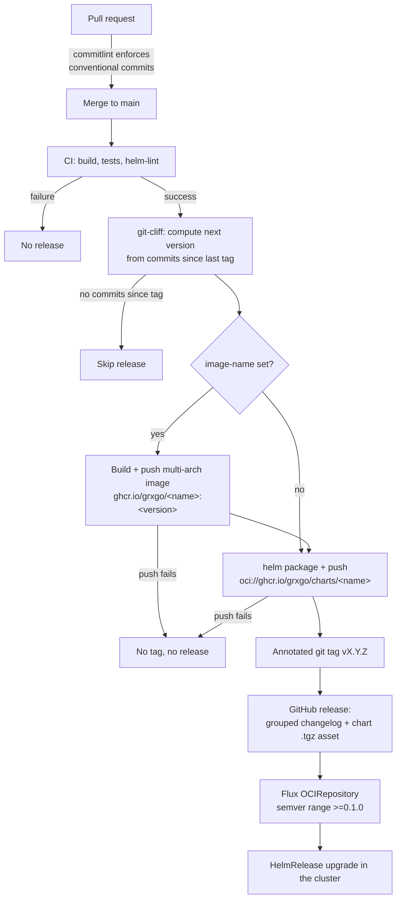

# Release Process

Every grxgo repo releases through the same reusable workflow
([`release-chart.yml`](../.github/workflows/release-chart.yml)); commit
messages follow Conventional Commits, enforced by
[`conventional-commits.yml`](../.github/workflows/conventional-commits.yml)
on every pull request.

## Flow

## Version bump rules

The next version is computed by [git-cliff](https://git-cliff.org/) from the
conventional commits since the last tag (config: [`cliff.toml`](../cliff.toml)):

| Commits since last tag contain | Bump | Example |
|---|---|---|
| `BREAKING CHANGE:` footer or `!` after the type | major | `v0.3.4` → `v1.0.0` |
| at least one `feat:` | minor | `v0.3.4` → `v0.4.0` |
| at least one `fix:` | patch | `v0.3.4` → `v0.3.5` |
| only other types (`refactor:`, `docs:`, `ci:`, …) | patch | `v0.3.4` → `v0.3.5` |
| no commits at all (re-run) | none | release skipped |

Every merge therefore ships: `main` never diverges from the latest release.

## Invariants

- **Tag == chart version == appVersion == image tag** (charts shipping
  third-party software keep their own appVersion via
  `app-version-from-release: false`).
- The tag is created **after** image and chart are published — a tag never
  points to a version that does not exist on GHCR.
- One release at a time per repo (`concurrency: chart-release`): parallel
  merges queue and each still gets its own version.
- Baseline: all repos were tagged `v0.2.0` on 2026-07-14, above the retired
  `0.1.<run_number>` scheme, so Flux's semver ranges migrate seamlessly.

## One chart per repo

The workflow derives one version per repository (repo tags). If a repo ever
hosts a second chart, the process needs per-chart tag prefixes first.
